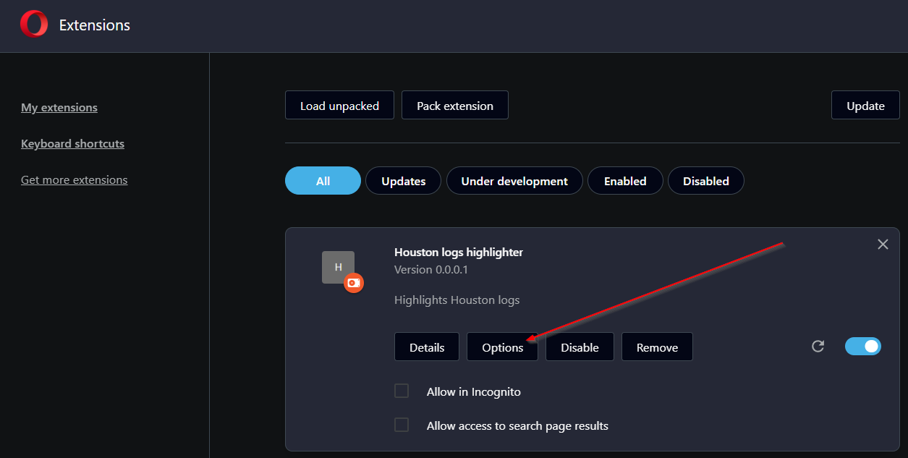
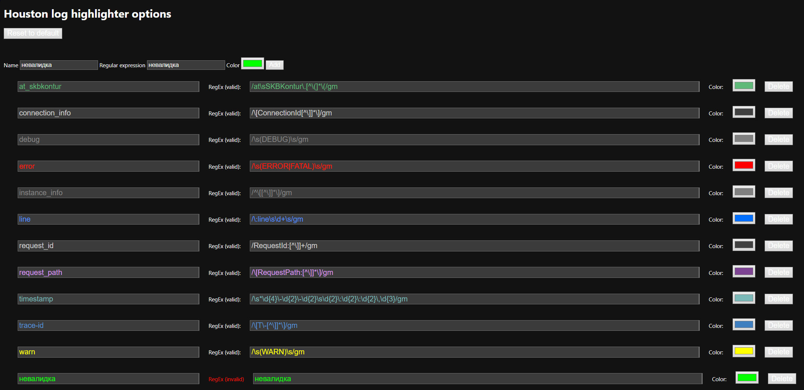

# houston-logs-highlighter

## Что делает

Браузерное расширение которое раскрашивает логи в Хьюстоне и LogSearchApi с помощью регулярных выражений.

<a href="https://staff.skbkontur.ru/api/images/uurcynp7/houston-logs-highlighter.png" target="_blank">Пример раскраски</a> (нужен доступ в  Стафф)

## Установка

Из [магазина chrome](https://chromewebstore.google.com/detail/houston-logs-highlighter/ckcnbpgkdhgimbnoogimfcjemdgaipgh)
   
## Настройка

Настройка регулярок и цветов происходит в опциях расширения.

На странице настроек можно добавлять новые регулярки и цвет в который будет окрашен текст соответствующий регулярке.

При изменении настроек они будут автоматически сохранены (сохранение раз в секунду), расширение подхватит их и перекрасит логи заново.

Невалидные регулярки будут подсвечены, для раскраски они не будут использоваться.

